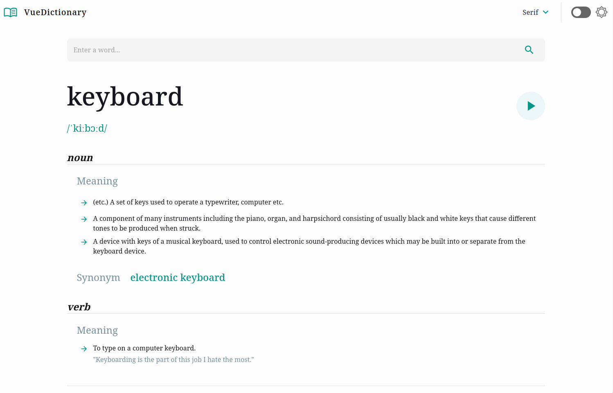
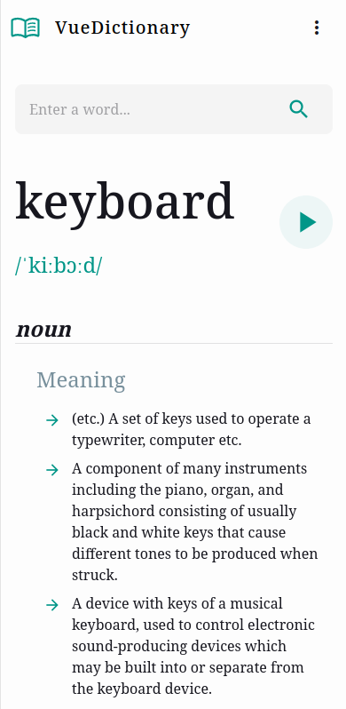

# Online Dictionary

This project is a PWA Online Dictionary inspired by the[Dictionary web app challenge on Frontend Mentor](https://www.frontendmentor.io/challenges/dictionary-web-app-h5wwnyuKFL).

## Table of contents

- [Overview](#overview)
  - [Features](#features)
  - [Screenshots](#screenshots)
  - [Links](#links)
- [My process](#my-process)
  - [Built with](#built-with)
  - [Other libraries](#other-libraries)

## Overview

### Features

Users should be able to:
  - Search for words using the input field
  - See the Free Dictionary API's response for the searched word
  - See a form validation message when trying to submit a blank form
  - Play the audio file for a word when it's available
  - Switch between serif, sans serif, and monospace fonts
  - Switch between light and dark themes
  - View the optimal layout for the interface depending on their device's screen size

### Screenshots

Desktop view:

Mobile view:

### Links

- Live Site URL: [VueDictionary](https://vue-dictionary.vercel.app/)

## My process

### Built with

- [Vue.js](https://vuejs.org/) - JS framework
- [Vite](https://vitejs.dev/) - Frontend build tool
- [Vuetify](https://vuetifyjs.com) - Vue Component Framework

### Other libraries

- [Axios](https://axios-http.com/) - Promise based HTTP client

